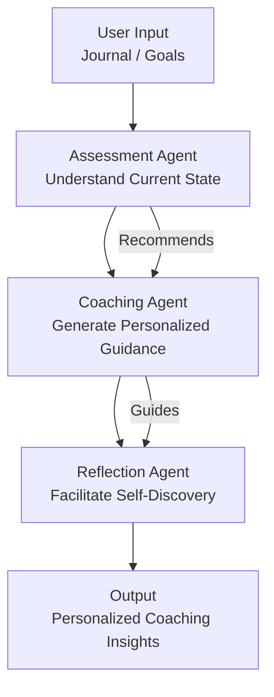

# MindBridge Coach - AI-Assisted Life Coaching Toolkit

[](https://www.python.org/)
[](LICENSE)
[](https://github.com/mrningzeoutlook-pixel/mindbridge-coach/actions)
[](https://pypi.org/project/mindbridge-coach/)

> **Empowering people to find their own answers.**

MindBridge Coach is an AI-assisted life coaching framework that helps people find clarity, set meaningful goals, and navigate life transitions with structured self-reflection and evidence-based coaching conversations.

## The Problem We Solve

Many people feel stuck, overwhelmed, or directionless but cannot access professional coaching. Traditional life coaching costs $150-500 per session, making it inaccessible for most. Meanwhile, self-help books lack personalization and accountability.

MindBridge provides an AI-assisted coaching framework that combines multiple evidence-based methodologies to guide you through self-discovery and action planning.

## Project Vision

This project reflects my deep commitment to helping others find their path. As someone pursuing a career in life coaching, I believe everyone deserves access to supportive tools for self-reflection and growth. MindBridge Coach is my contribution to making quality coaching accessible to all.

## Features

- **Three-Layer Agent Architecture**: Assessment → Coaching → Reflection
- **Multiple Coaching Frameworks**: GROW, Ikigai, SMART Goals, Wheel of Life
- **Structured Reflection Practices**: Daily, weekly, and monthly prompts
- **Modular Design**: Use individual agents or the full pipeline
- **Extensible**: Easy to add new frameworks and prompts

## Architecture



### Three-Agent System

| Agent | Role | Responsibility |
|-------|------|----------------|
| **Assessment Agent** | Evaluator | Understand current situation, recommend frameworks |
| **Coaching Agent** | Guide | Generate structured coaching using selected framework |
| **Reflection Agent** | Facilitator | Create reflection prompts, identify patterns |

## Coaching Frameworks

MindBridge Coach implements several evidence-based coaching methodologies:

| Framework | Best For | Duration | Stages |
|-----------|----------|-----------|--------|
| **GROW Model** | Career decisions, problem solving | ~30 min | Goal, Reality, Options, Will |
| **Ikigai** | Finding purpose, life transitions | ~45 min | Passion, Mission, Vocation, Profession |
| **SMART Goals** | Converting aspirations to action | ~25 min | Specific, Measurable, Achievable, Relevant, Time-bound |
| **Wheel of Life** | Holistic life balance assessment | ~20 min | 8 life areas rated 0-10 |

## Quick Start

### Installation

```bash
# Clone the repository
git clone https://github.com/mrningzeoutlook-pixel/mindbridge-coach.git
cd mindbridge-coach

# Install dependencies
pip install -r requirements.txt

# Or install in development mode
pip install -e ".[dev]"
```

### Command Line Usage

```bash
# Start a coaching session
python -m src.pipeline session --focus "career-transition"

# Run a reflection exercise
python -m src.pipeline reflect --prompt weekly

# Full experience (session + reflection)
python -m src.pipeline full --focus purpose --reflection monthly
```

### Python API

```python
from src.agents.pipeline import MindBridgePipeline

# Initialize the pipeline
pipeline = MindBridgePipeline()

# Run a coaching session
output = pipeline.session("career-transition")
print(output)

# Or run a reflection
output = pipeline.reflect("weekly")
print(output)
```

### Using Individual Agents

```python
from src.agents.assessment_agent import AssessmentAgent
from src.agents.coaching_agent import CoachingAgent
from src.agents.reflection_agent import ReflectionAgent

# Step-by-step coaching
assessment = AssessmentAgent()
coaching = CoachingAgent()
reflection = ReflectionAgent()

# 1. Assessment
result = assessment.assess("purpose")
print(f"Recommended: {result.recommended_framework}")

# 2. Coaching
guidance = coaching.coach({"focus_area": result.focus_area}, result.recommended_framework)
print(f"Framework: {guidance.framework}")

# 3. Reflection
guide = reflection.reflect("weekly")
for prompt in guide.prompts:
    print(f"- {prompt.question}")
```

## Project Structure

```
mindbridge-coach/
├── src/
│   ├── agents/
│   │   ├── __init__.py
│   │   ├── assessment_agent.py    # Assessment Agent
│   │   ├── coaching_agent.py      # Coaching Agent
│   │   ├── reflection_agent.py     # Reflection Agent
│   │   └── pipeline.py            # Main pipeline orchestrator
│   ├── config/
│   │   ├── __init__.py
│   │   ├── grow_config.py         # GROW Model configuration
│   │   ├── ikigai_config.py       # Ikigai configuration
│   │   ├── smart_config.py        # SMART Goals configuration
│   │   ├── wheel_of_life_config.py # Wheel of Life configuration
│   │   └── reflection_prompts.py   # Reflection prompt templates
│   └── utils/
│       ├── __init__.py
│       ├── formatters.py          # Output formatting utilities
│       ├── validators.py          # Input validation
│       └── logger.py              # Logging configuration
├── tests/
│   ├── test_assessment_agent.py
│   ├── test_coaching_agent.py
│   ├── test_reflection_agent.py
│   ├── test_pipeline.py
│   ├── test_config.py
│   └── test_utils.py
├── examples/
│   ├── basic_session.py
│   ├── reflection_practice.py
│   ├── individual_agents.py
│   ├── full_experience.py
│   └── custom_flows.py
├── docs/
│   ├── CONTRIBUTING.md
│   └── CODE_OF_CONDUCT.md
├── pyproject.toml
├── requirements.txt
├── LICENSE
├── README.md
└── .gitignore
```

## Configuration

### Environment Variables (.env)

```bash
# Create a .env file based on .env.example
cp .env.example .env

# Optional: Configure logging level
LOG_LEVEL=INFO
```

### Focus Areas

The assessment agent recognizes these focus areas:

- `career-transition` / `career` → GROW Model
- `purpose` / `purpose-discovery` / `self-discovery` → Ikigai
- `goal-setting` / `goals` / `productivity` → SMART Goals
- `life-balance` / `balance` → Wheel of Life

### Reflection Types

Available reflection prompt types:

- `daily` - Quick daily check-ins (4-5 prompts)
- `weekly` - Weekly review (5-6 prompts)
- `monthly` - Monthly deep reflection (5-6 prompts)
- `goal-review` - Goal-specific review (5 prompts)
- `gratitude` - Gratitude practice (5 prompts)
- `morning` / `evening` - Time-of-day reflections

## Testing

```bash
# Run all tests
pytest

# Run with coverage
pytest --cov=src --cov-report=html

# Run specific test file
pytest tests/test_assessment_agent.py

# Run in verbose mode
pytest -v
```

## Contributing

Contributions are welcome! Please see [CONTRIBUTING.md](docs/CONTRIBUTING.md) for guidelines.

## Code of Conduct

Please read our [Code of Conduct](docs/CODE_OF_CONDUCT.md) before contributing.

## Roadmap

- [x] Core coaching conversation engine
- [x] Assessment and reflection frameworks
- [x] Modular agent architecture
- [ ] Session memory and continuity
- [ ] Progress tracking dashboard
- [ ] Community sharing (anonymous)
- [ ] Integration with journaling apps
- [ ] AI integration for personalized guidance

## License

MIT License - see [LICENSE](LICENSE) for details.

## Acknowledgments

- The GROW Model by John Whitmore
- Ikigai concept from Japanese philosophy
- SMART Goals framework by George Doran
- Wheel of Life by Paul J. Meyer
- All the coaches and mentors who inspire this work

---

*"The task of leadership is not to put greatness into people, but to elicit it, for the greatness is there already."* — John Whitmore

**Empowering people to find their own answers.**
